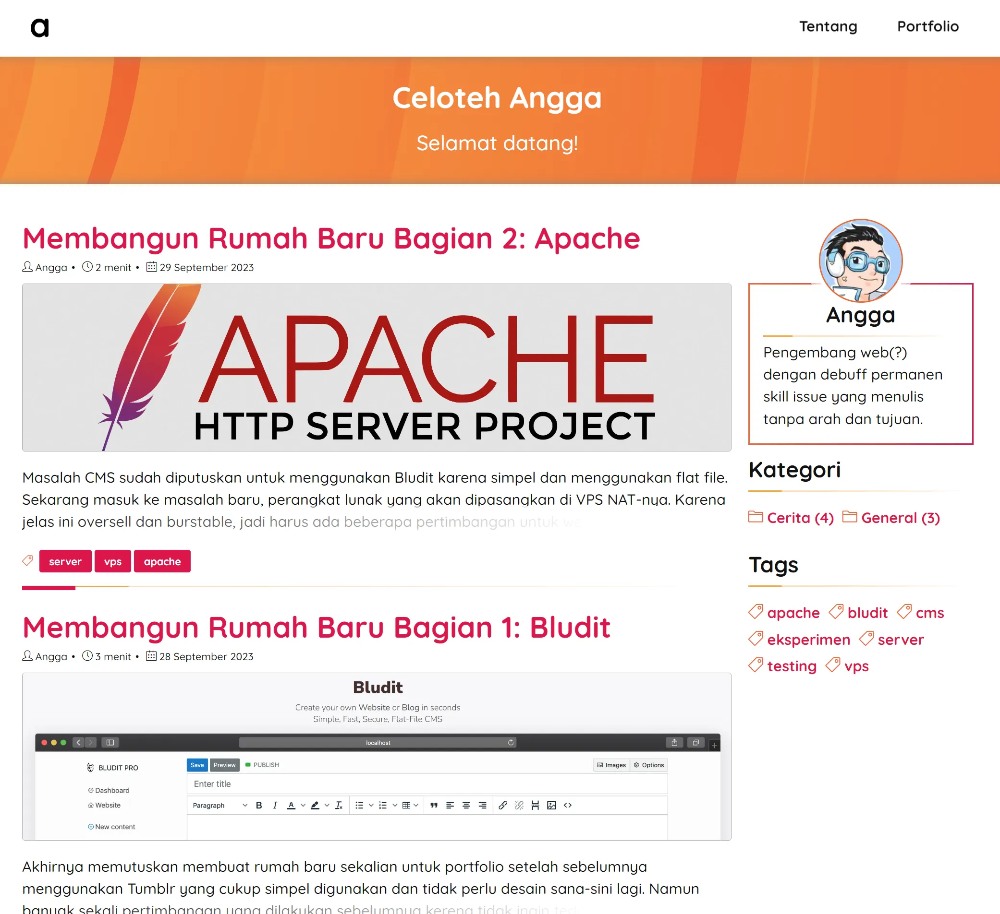
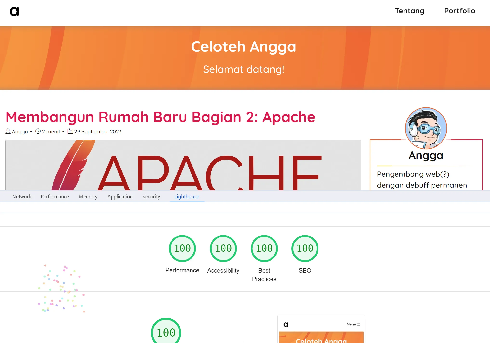

# Solen for Bludit Theme

A bright and simple Bludit blogging theme made with Picnic CSS and Simple Line Icons with support for screen reader users. 

## Features

- Very light on various desktop and mobile browser with responsive design
- Support for screen reader users
- Three languages support: Indonesian, English, and Japanese
- Good contrast ratio
- Critical inline CSS and asynchronous CSS load
- Made with Picnic CSS and Simple Line Icons
- Minimal and non-intrusive use of Javascript

## Screenshot

## Mobile Performance

